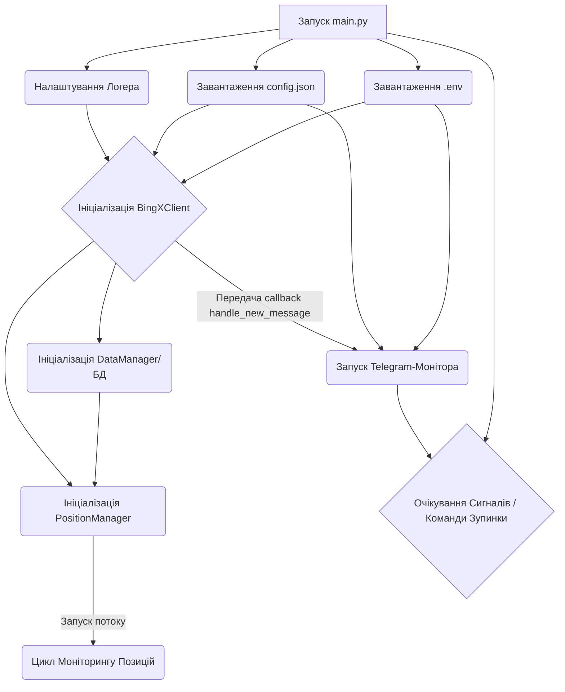
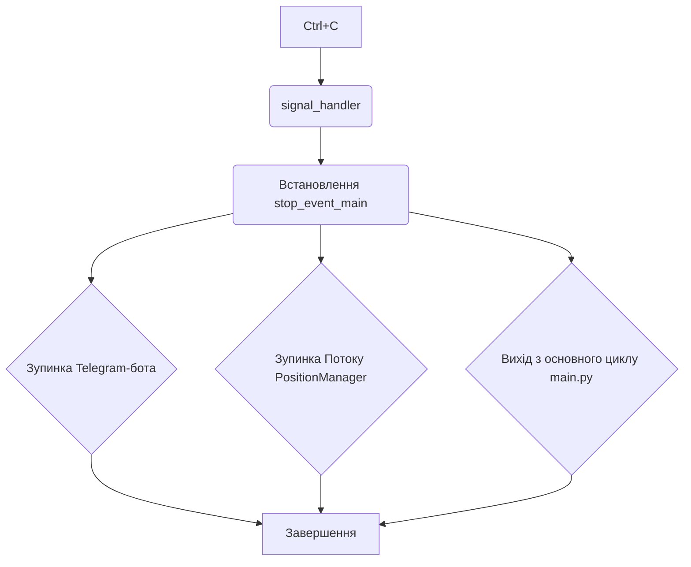

# Блок-схема Роботи Бота (Текстова Версія з Mermaid)

Цей файл описує основні потоки роботи торгового бота за допомогою синтаксису Mermaid.

## 1. Ініціалізація



**Пояснення:**

- Скрипт запускається, налаштовує логування, завантажує конфігурації.
- Ініціалізуються основні компоненти: клієнт біржі, менеджер даних, менеджер позицій.
- Запускається окремий потік для моніторингу позицій.
- Запускається Telegram-бот, який очікує на нові повідомлення та команди.

## 2. Обробка Нового Сигналу

```mermaid
graph TD
    subgraph Обробка в main.handle_new_message
        K[Telegram -> Нове повідомлення в цільовому чаті] --> L(Ідентифікація Джерела сигналу);
        L -- Невідоме Джерело --> Z[Кінець Обробки];
        L -- OK --> M{Парсинг Сигналу (signal_interpreter)};
        M -- Парсинг Fail --> Z;
        M -- signal_data --> N(Перевірка Слоту (check_slot_availability));
        N -- Немає Слоту --> Z;
        N -- Є Слот --> O{Виконання Торг. Логіки (залежить від каналу)};

        subgraph Торгова Логіка
            O -- Market Order (C1, C2, C4) --> P1(BingXClient: place_market_order_basic);
            O -- Limit Order (C3) --> P2(BingXClient: place_limit_order);
            P1 -- Ордер Виконано --> Q{Встановлення SL/TP};
            P2 -- Ордер Створено --> Q;
            P1 -- Помилка Ордера --> Z;
            P2 -- Помилка Ордера --> Z;
            Q --> R(BingXClient: set_stop_loss);
            R -- OK --> S(BingXClient: set_take_profits);
            R -- SL Fail --> T(Лог Критичної Помилки);
            S -- TP Fail --> U(Лог Помилки TP);
            S -- TP OK --> V(DataManager: add_new_position);
            T --> Z;
            U --> V; # Все одно зберігаємо з SL, якщо він є
            V --> Z;
        end
    end
```

**Пояснення:**

- Telegram-бот отримує повідомлення і викликає `handle_new_message`.
- Визначається джерело, парситься сигнал, перевіряється ліміт слотів.
- Якщо все гаразд, виконується торгова логіка: розміщується ринковий або лімітний ордер.
- Після успішного входу розміщуються SL та TP ордери.
- Інформація про нову позицію та пов'язані ордери зберігається в БД.

## 3. Фоновий Моніторинг Позицій (Потік PositionManager)

```mermaid
graph TD
    subgraph Цикл Моніторингу (_monitor_loop -> _check_single_position)
        W[Start Циклу] --> X{DataManager: get_active_positions};
        X -- Список позицій --> Y(Ітерація по кожній позиції);
        Y -- ID ордерів --> Z{BingXClient: fetch_orders (SL/TP)};
        Z -- Статуси ордерів --> AA{Аналіз Статусу SL};
        AA -- SL Спрацював --> AB(Обробка Закриття: SL Hit);
        AA -- SL Не спрацював --> AC{Аналіз Статусів TP};
        AC -- TP Спрацював --> AD{Зменшення Залишку Позиції};
        AD --> AE{Перевірка TP1 для БЗ};
        AE -- TP1 & не БЗ --> AF{BingXClient: edit_order (SL)};
        AF -- OK --> AG(DataManager: оновлення БЗ);
        AF -- Fail --> AH[Лог Помилки БЗ];
        AG --> AI{Перевірка Повного Закриття TP};
        AH --> AI;
        AE -- не TP1 або вже БЗ --> AI;
        AC -- Жоден TP не спрацював --> AI;
        AI -- Залишок 0 --> AJ(Обробка Закриття: TP Hit);
        AI -- Залишок > 0 --> AK[Кінець обробки поточної позиції];
        AB -- Позиція Закрита --> AK;
        AJ -- Позиція Закрита --> AK;
        Y -- Наступна позиція --> Y;
        AK -- Позиції закінчились --> L(Пауза);
        L --> W;
    end

    subgraph Обробка Закриття (_handle_position_closed)
        M[Вхід] --> N(DataManager: update_position_status);
        N --> O(Лог Закриття);
        O --> P(Сигналізація про звільнення слоту (заглушка));
        P --> Q[Кінець];
    end
```

**Пояснення:**

- Окремий потік періодично отримує активні позиції з БД.
- Для кожної позиції перевіряються статуси її SL та TP ордерів на біржі.
- Якщо SL спрацював, позиція позначається як закрита в БД.
- Якщо TP спрацював:
  - Зменшується розрахунковий обсяг позиції.
  - Якщо це був TP1 і позиція ще не в БЗ, робиться спроба перемістити SL на ціну входу за допомогою `edit_order`.
  - Якщо `edit_order` вдалося, статус БЗ оновлюється в БД.
  - Для каналу 3 скасовується пов'язаний лімітний ордер.
- Якщо всі TP спрацювали або залишок обсягу став нульовим, позиція позначається як закрита.
- Цикл повторюється після паузи.

## 4. Зупинка Бота



**Пояснення:**

- Сигнал Ctrl+C встановлює подію зупинки.
- Ця подія сигналізує Telegram-боту та потоку моніторингу позицій про необхідність завершити роботу.
- Основний скрипт також завершує своє виконання.

Відкрити цей файл на GitHub/GitLab.
Використати розширення для вашого редактора коду (наприклад, Markdown Preview Mermaid Support для VS Code).
Вставити код діаграм (всередині ``mermaid ... ``` ) в онлайн-редактор Mermaid (наприклад, [mermaid.live](https://mermaid.live/)).Сподіваюся, ця візуалізація буде корисною для розуміння та подальшого розвитку проєкту!